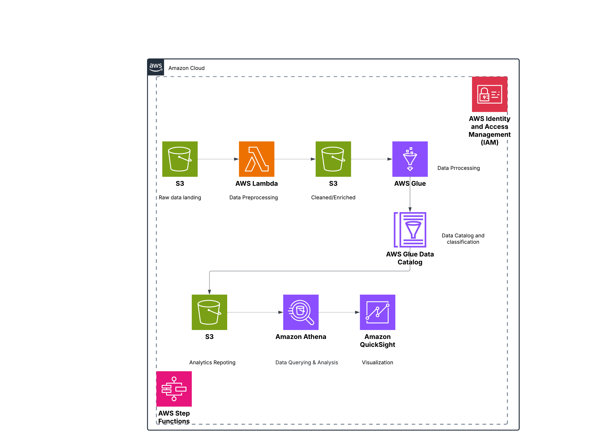

# YouTube Video Data Engineering Project

## Overview
This project is designed to securely manage, process, and analyze both structured and semi-structured YouTube video data. By leveraging cloud-based services, the project focuses on categorizing videos and identifying trends through key performance metrics such as views, likes, and engagement. The solution emphasizes scalability, automation, and efficient data handling to support data-driven insights.

## Project Objectives
### 1. **Data Ingestion**
- Implement a mechanism to ingest data from various sources, including APIs and external datasets, ensuring secure and efficient data collection.

### 2. **ETL System**
- Transform raw data into a structured format by applying cleaning, standardization, and schema alignment to prepare it for storage and analysis.

### 3. **Data Lake**
- Utilize a centralized repository to store data from multiple sources, making it accessible for analytics and scalable as data volume increases.

### 4. **Scalability**
- Design a system that can handle increasing data volume without compromising performance by leveraging cloud services.

### 5. **Cloud Processing**
- Process and store large datasets in a cloud environment to take advantage of scalable computing power and storage solutions.

### 6. **Reporting & Insights**
- Build interactive dashboards to visualize trends and answer key business questions, providing actionable insights based on video performance metrics.

## Architecture Overview
The solution follows a **cloud-based data engineering workflow** to ensure scalability and automation.

### **Architecture Diagram**

### **Workflow Components**
| Component                 | Description |
|---------------------------|-------------|
| **Data Source**           | YouTube API and Kaggle dataset provide the raw data for ingestion. |
| **Data Ingestion**        | AWS Lambda functions and AWS Glue jobs handle ingestion and storage in Amazon S3. |
| **Data Transformation**   | AWS Glue performs ETL operations, transforming raw JSON/CSV data into a structured format. |
| **Data Storage**          | Cleaned and processed data is stored in Amazon S3 as part of a data lake architecture. |
| **Data Querying & Analysis** | Amazon Athena enables SQL querying of the data stored in S3. |
| **Visualization**         | Amazon QuickSight provides a dashboard to analyze YouTube video trends. |

## Services & Tools Used
The project leverages the following AWS services and technologies:
- **Amazon S3** - Object storage service for scalable and high-performance data storage.
- **AWS IAM** - Controls secure access to AWS services.
- **Amazon QuickSight** - Business Intelligence tool for data visualization.
- **AWS Glue** - Serverless ETL service for data preparation and transformation.
- **AWS Lambda** - Serverless compute service for event-driven automation.
- **Amazon Athena** - Interactive SQL querying on S3 data without requiring a database.

## Dataset Description
The dataset used for this project is sourced from **Kaggle**, containing daily statistics on trending YouTube videos across multiple countries. Each dataset file includes:
- **Metadata**: Video title, channel name, publication date, tags.
- **Performance Metrics**: Views, likes, dislikes, comment count.
- **Categorization**: Unique category identifier per region.

> Dataset Source: [YouTube Trending Videos Dataset on Kaggle](https://www.kaggle.com/)

## Key Features
✅ **Automation** - Serverless infrastructure automates data ingestion, transformation, and querying.  
✅ **Scalability** - Cloud-native architecture ensures seamless scaling as data volume grows.  
✅ **Data Exploration** - Athena allows querying large datasets stored in S3 without complex setup.  
✅ **Visualization** - Dashboards provide real-time insights, making the data accessible to stakeholders.  

## Future Enhancements
🔹 **Streaming Data Processing** using **Kafka & Kinesis**  
🔹 **AI/ML Integration** for trend prediction & sentiment analysis  
🔹 **Multi-Cloud Support** for hybrid data processing workflows  

## Author
👩‍💻 **Maryam Shirazi**  
📌 [LinkedIn](www.linkedin.com/in/maryam-a-shirazi)  
📌 [GitHub](https://github.com/MaryamShirazi1366/)  

